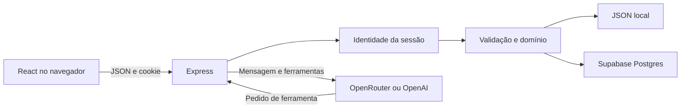

# Arquitetura

## Visão estrutural

O navegador não consulta o banco diretamente. A API é a fronteira de autorização. Sua chave privilegiada acessa tabelas bloqueadas aos papéis públicos. Na Vercel, api/index.ts importa o Express e impede persistência local efêmera.

## Responsabilidades

| Módulo | Papel |
| --- | --- |
| src/main.tsx | Sessão, páginas, Dashboard e coordenação |
| src/domain.ts | Schemas, períodos, métricas e moeda |
| src/commitments.ts | Agenda e vencimentos |
| src/debts.ts | Dívidas e total |
| src/Statement.tsx | Extrato e saldo acumulado |
| src/CommitmentView.tsx | Compromissos e pagamentos |
| src/DebtView.tsx | Dívidas |
| src/Fields.tsx | Select e calendário |
| src/Login.tsx | Entrada e ativação local |
| src/Onboarding.tsx | Tutorial |
| src/QuickActions.tsx | Atalhos |
| server/auth.ts | Login, sessão, origem e isolamento |
| server/index.ts | Rotas, armazenamento e agente |
| server/payments.ts | Solicitação de pagamento |
| server/account.ts | Conta local interativa |
| api/index.ts | Adapter Vercel |

## Leitura e escrita

A sessão determina owner. O caminho é comparado com essa identidade; alterá-lo não concede acesso. Leituras filtram owner. Atualizações e exclusões combinam id e owner. Zod reconstrói campos permitidos; o servidor define identificador e identidade, ignorando tentativas de reatribuição no corpo.

No banco, pagamentos validam agenda, bloqueiam o compromisso, procuram ocorrência já paga e inserem despesa/vínculo atomicamente. O modo local serializa pagamentos dentro da instância, sem garantia distribuída.

## Persistência

Local: JSON, gravação temporária/rename, contas scrypt e sessões em memória. Use uma instância; filas não coordenam processos separados. Reiniciar encerra sessões locais.

Produção: Postgres e tokens opacos. O cookie guarda o token; a tabela guarda SHA-256 e expiração. Instâncias compartilham sessões e verificam validade a cada consulta. Sem configuração Supabase, a entrada Vercel retorna 503.

## Decisões

| Decisão | Motivo | Consequência |
| --- | --- | --- |
| Dois owners fixos | Escopo enxuto | Expansão exige schema e identidade novos |
| API central | Autorização uniforme | Backend é fronteira crítica |
| RLS sem policies públicas | Bloqueio de cliente direto | Advisor pode informar ausência de policies |
| Centavos nas somas | Precisão | Manter conversão em novas métricas |
| Páginas internas | Poucas telas | Sem URLs/roteamento individual |
| Sessões próprias | Cookie uniforme | Revogação Supabase não encerra automaticamente sessões próprias |
| Propostas do agente | Escritas revisáveis | Confirmação é UX, não token transacional assinado |

## Evolução

Mantenha agenda TypeScript e SQL equivalentes. Não delegue cálculos ao modelo. Novos usuários exigem identidade estável e desenho de autorização; substituir enum por texto livre não basta.

Não há auditoria imutável, controle de versão por registro, limite de tentativas distribuído ou limpeza automática de sessões expiradas. Consulte Segurança e Operação.
